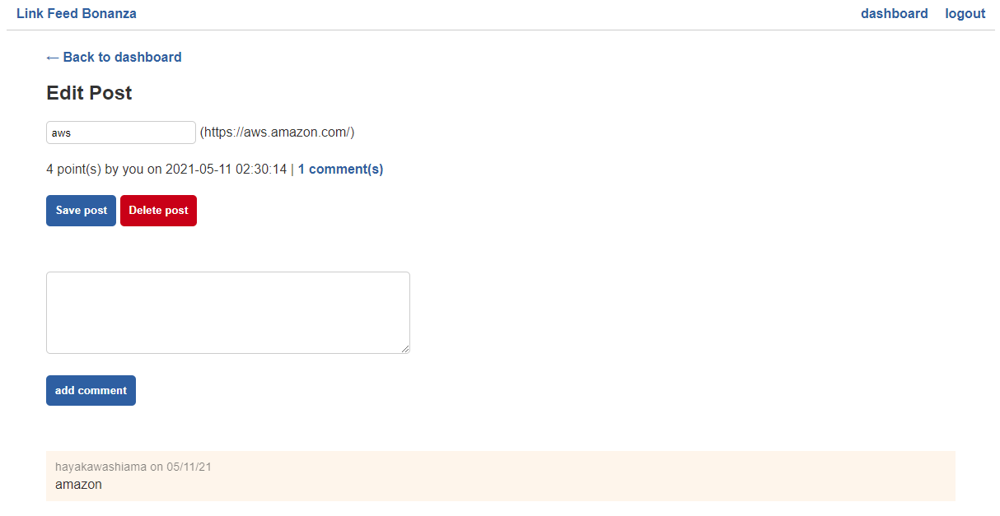

# Link-Feed-Python

Link feed bonanza. Post titles, links, upvote... Kind of like reddit

Python back-end, html templates, javascript fetch, css

## Live application

https://link-feed-bonanza.herokuapp.com/

## Running the tests

There were no automated tests during the process of this application. Launch and see if it works, fix bugs.

## Built With

bcrypt==3.2.0
cffi==1.14.5
click==7.1.2
cryptography==3.4.7
Flask==1.1.2
greenlet==1.1.0
gunicorn==20.1.0
itsdangerous==1.1.0
Jinja2==2.11.3
MarkupSafe==1.1.1
pycparser==2.20
PyMySQL==1.0.2
python-dotenv==0.17.1
six==1.16.0
SQLAlchemy==1.4.14
Werkzeug==1.0.1

## Contributing

There are many ways in which you can participate in the project, for example: 
* Submit bugs and feature requests to the email below, and help us verify as they are checked in 
* Review source code changes
* Review the documentation and make pull requests for anything from typos to new content

## Authors

Sole author

## Questions

For any additional questions see my [GitHub profile](http://github.com/tylerpetri) or contact tylerpetri93@gmail.com
